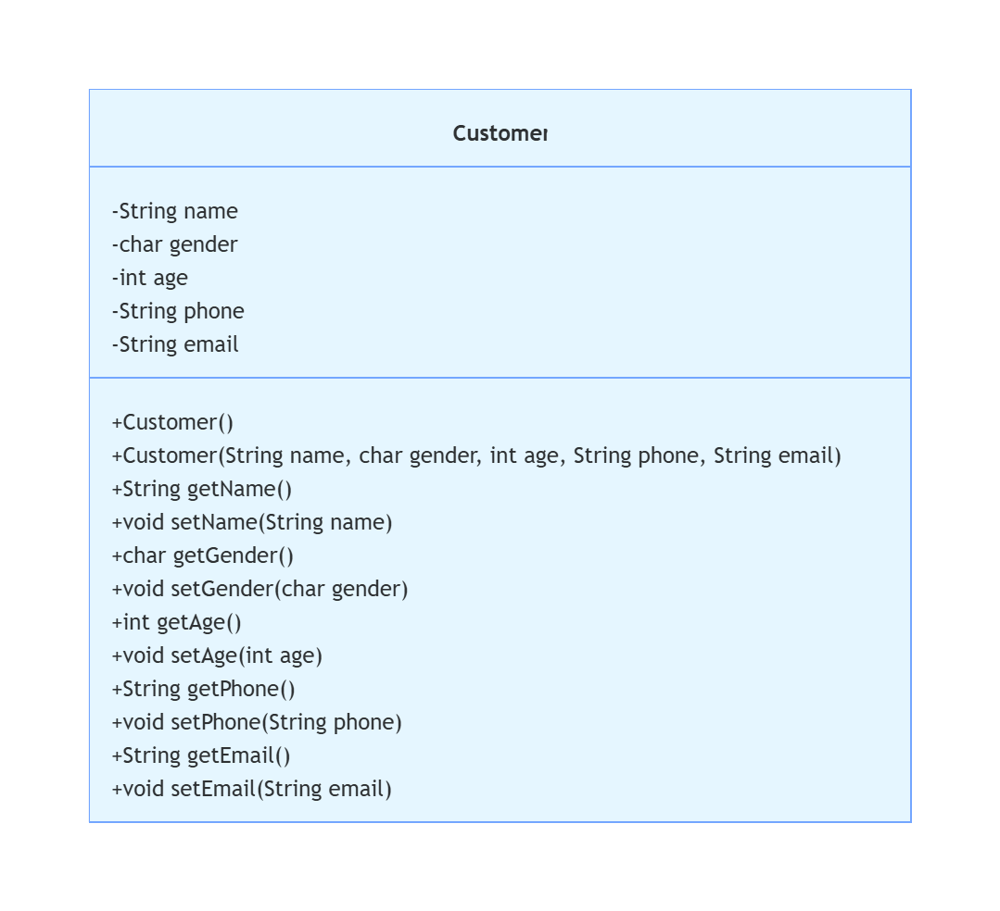

    

------

[TOC]

## 介绍

本系统是基于文本界面的《拼电商客户管理系统》，基于[尚硅谷java教学](https://www.bilibili.com/video/BV1PY411e7J6/?p=92&share_source=copy_web&vd_source=677c1741a71bb7c3bc8dfabb8644f7dc)中的例子有所改变，仅供学习

## 系统设计结构

该系统由CustomerView、CustomerList、Customer三个模块组成
- CustomerView为主模块，负责菜单的显示和处理用户操作
- CustomerList为Customer对象的管理模块，负责客户的增删改查
- Customer为实体对象，封装客户信息

### Customer类的设计

Customer类是javabean类，包含姓名(name)、性别(gender)、年龄(age)、电话(phone)、邮箱(email)属性。

    

### CustomerList类的设计

CustomerList类为Customer类的管理模块，内部使用数组管理一组Customer对象，封装了增删改查方法。

